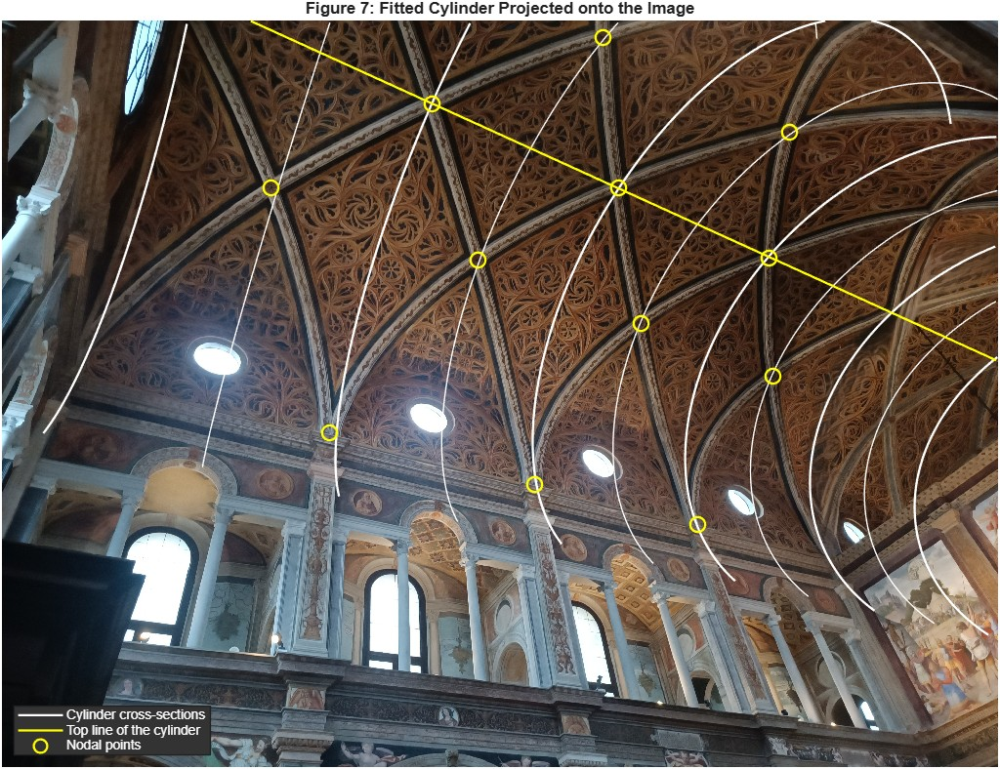

# 3D reconstruction of a church vault from one photo

Metric 3D reconstruction of the vault of San Maurizio in Milan from a single uncalibrated photograph, in MATLAB. Individual homework for *Image Analysis and Computer Vision* at Politecnico di Milano (2025/26).

The only inputs are the photo and three facts about the scene: the vault is a cylinder, its ribs come in two symmetric families of diagonal arcs, and neighbouring arcs of a family are one unit apart. Nothing is known about the camera except that it has zero skew.

## Pipeline

| Vanishing points and vanishing line | Metric rectification |
|---|---|
|  |  |

1. **Features.** Vertical lines, lines along the vault axis, transversal lines and points on the diagonal arcs, picked with `feature_picker.m` and stored in `features_fixed.mat`.
2. **Vanishing points.** One per orthogonal direction, each from a least-squares (SVD) fit over its family of lines in normalised coordinates. The vanishing line of the planes perpendicular to the axis is the join of the vertical and transversal vanishing points.
3. **Rectification.** Stratified: affine rectification from the vanishing line, then metric rectification with two constraints. Orthogonality of the vertical and transversal directions fixes the skew. The circular cross-section of the vault fixes the aspect ratio: an arc of one family and an arc of the other are mirror images in a plane perpendicular to the axis, so on every line through the axis vanishing point the harmonic midpoint of the two arcs is the image of a point of that plane's cross-section circle. Nine such circles are fitted together with one shared aspect ratio.
4. **Calibration.** The calibration matrix K from the image of the absolute conic, constrained by the three orthogonal vanishing points and the rectifying homography.
5. **3D reconstruction.** The axis direction is its vanishing point back-projected through K. The apical nodes, one unit apart along the axis, fix the scale. Each cross-section is back-projected onto its plane and fitted with a circle, which gives the radius and the position of the axis. The arcs are then recovered by intersecting their camera rays with the cylinder.

## Results

The fitted cylinder drawn back onto the photo: cross-sections every half rib spacing, the top line of the vault, and the picked rib crossings.

- Calibration: fx = 3110 px, fy = 2823 px, principal point (2143, 1891) in a 4000 x 3000 image.
- Cylinder radius 1.18 units (1.14 to 1.20 over the nine cross-sections), axis direction [0.875, 0.235, 0.423] in the camera frame, camera 2.80 units from the axis.
- The apex line sits 1.17 above the fitted axis, against a radius of 1.18, and the circle centres have no sideways offset from it.
- Stepping from the first apical node along the axis by one and two rib spacings lands 7 px and 3 px from the other two apical nodes in the image.
- Neighbouring arcs of a family come out 1.01 apart along the axis (1.00 to 1.03 over six pairs), against the given 1. This holds for any calibration consistent with the vanishing points, so it checks the reconstruction but not K.

One limit is worth knowing. Assuming square pixels, the three vanishing points alone give f = 2852 px and a principal point of (1987, 1510), 16 px from the image centre. That differs from the calibration above by 9% in fx and 380 px in the principal point, more than the picking noise explains: with square pixels the ribs would trace a cross-section a little over 10% wider than tall. The assignment models the vault as an exact circle and the camera with independent fx and fy, so the script reports that solution and prints the square-pixel one next to it.

More views are in [docs/figures](docs/figures).

## Correction after submission

[docs/Report.pdf](docs/Report.pdf) is the report as submitted in January 2026. The code here was corrected in October 2026 and no longer matches the report's method for step 3 or its numbers:

- The submitted version fitted one circle to nodal points that belong to different cross-sections. That gave an aspect ratio of 0.90 instead of 0.45, and from it fx = 1871, fy = 2422 and a principal point at the top edge of the image.
- Nodal points were intersected in the rectified plane, where the arcs that cross the vanishing line are torn apart. The first apical node was 110 px off.
- Node depths and the cylinder radius were computed with every node placed in the first cross-section.

The vanishing points, the affine rectification and the calibration equations are unchanged.

## Running it

Open MATLAB in this folder and run `vault_reconstruction.m` (the rectified image needs the Image Processing Toolbox). It loads `San Maurizio.jpg` and `features_fixed.mat`, prints every intermediate result, and draws the seven figures. To pick the features again, run `feature_picker.m`.

The photo is the one handed out with the assignment.
