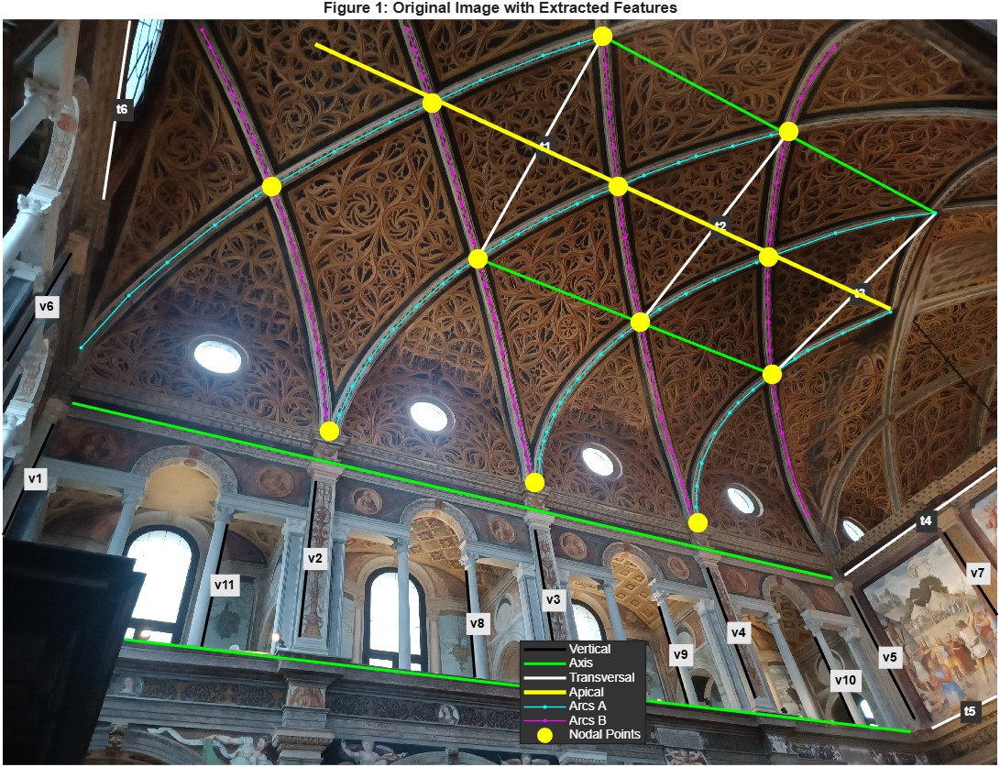
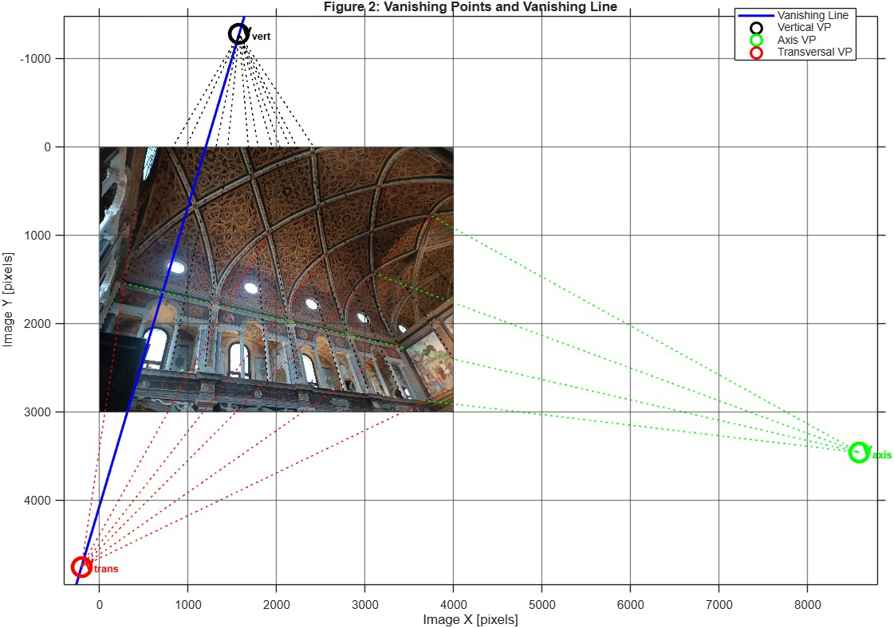
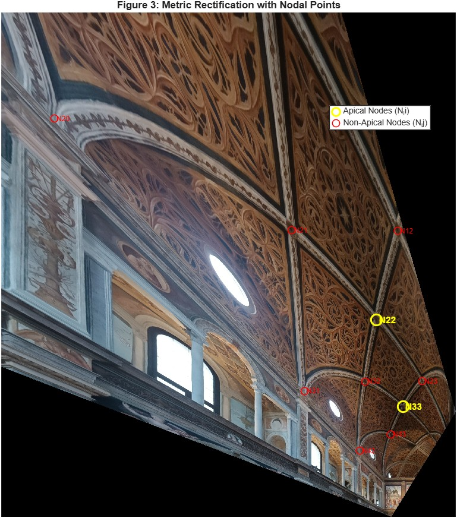
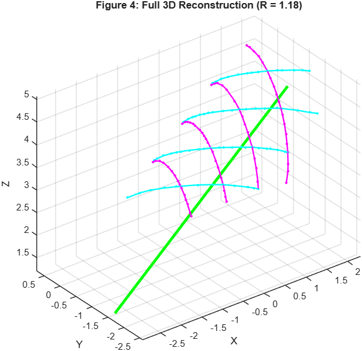

# 3D reconstruction of a church vault from one photo

Metric 3D reconstruction of the vault of San Maurizio in Milan from a single uncalibrated photograph, in MATLAB. Individual homework for *Image Analysis and Computer Vision* at Politecnico di Milano (2025/26). Full write-up with the theory and derivations: [docs/Report.pdf](docs/Report.pdf).

The only inputs are the photo and three facts about the scene: the vault is a cylinder, its ribs come in two symmetric families of diagonal arcs, and neighbouring arcs of a family are one unit apart. Nothing is known about the camera.

## Pipeline

| Vanishing points and vanishing line | Metric rectification |
|---|---|
|  |  |

1. **Features.** Vertical lines, lines along the vault axis, transversal lines and points on the diagonal arcs, picked with `feature_picker.m` and stored in `features_fixed.mat`.
2. **Vanishing points.** One per orthogonal direction, each from a least-squares (SVD) fit over its family of lines in normalised coordinates. The vanishing line of the plane perpendicular to the axis is the join of the vertical and transversal vanishing points.
3. **Rectification.** Stratified: affine rectification from the vanishing line, then metric rectification with two constraints. Orthogonality of the line families fixes the skew, and the circular cross-section of the vault fixes the aspect ratio.
4. **Calibration.** The calibration matrix K from the image of the absolute conic, constrained by the three orthogonal vanishing points and the rectifying homography.
5. **3D reconstruction.** The axis direction is its vanishing point back-projected through K. Two apex nodes one unit apart along the axis fix the scale, which gives the radius and position of the cylinder. The arcs are then recovered by intersecting their camera rays with the cylinder.

## Results

- The two apex nodes that set the scale come out 0.998 apart against the assumed 1. That is a consistency check of the least-squares fit, not an independent measurement.
- The independent check is the spacing between reconstructed arc centroids: 0.879 against a true value of 1, a 12% error and the weakest part of the result.
- Estimated calibration: fx = 1871 px, fy = 2422 px. The principal point lands near the top edge of the image, which says the single-view constraints pin it down poorly.
- Cylinder radius 1.30 units; axis direction [0.905, 0.346, 0.246] in the camera frame.

More views are in [docs/figures](docs/figures).

## Running it

Open MATLAB in this folder and run `vault_reconstruction.m`. It loads `San Maurizio.jpg` and `features_fixed.mat`, prints every intermediate result, and draws the six figures used in the report. To pick the features again, run `feature_picker.m`.

The photo is the one handed out with the assignment.
